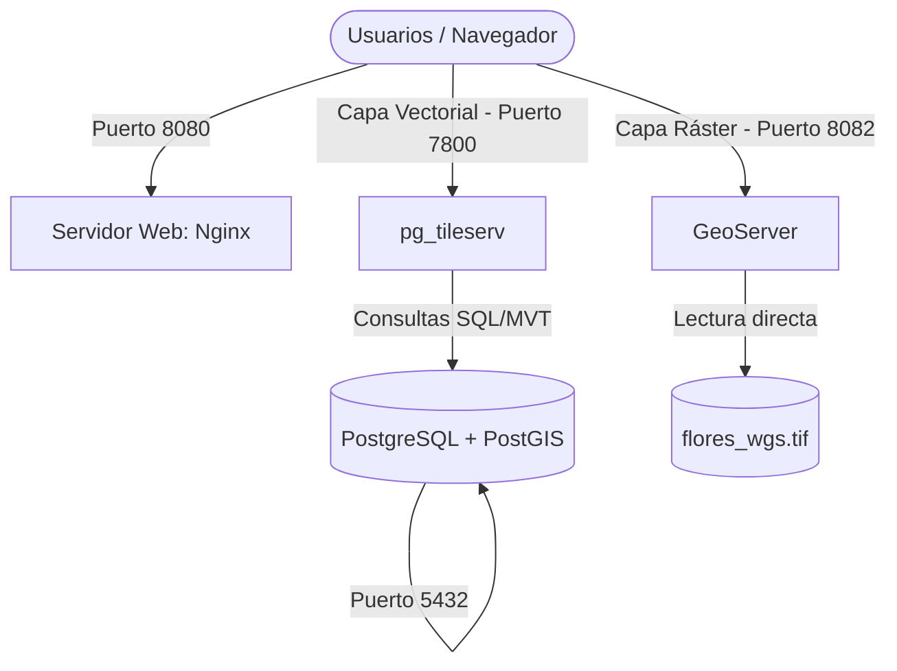

# Plataforma de Infraestructura de Datos Espaciales (IDE) Local

Este repositorio contiene un prototipo de producción local para una **Infraestructura de Datos Espaciales (IDE)**, inspirada en plataformas públicas como *Mapas Córdoba*. El proyecto despliega de forma contenerizada una base de datos espacial, un servidor de teselas vectoriales para capas CAD/Shapefile, un servidor GIS para capas ráster de alta resolución (ortofotos), y un visor cartográfico interactivo de alto rendimiento.

## 🗺️ Arquitectura del Sistema

La arquitectura está diseñada bajo el principio de desacoplamiento de servicios y optimización web:



* **Base de Datos Espacial:** `PostgreSQL 15` con la extensión `PostGIS 3.3` para almacenamiento indexado y análisis espacial.
* **Servidor de Capas Vectoriales:** `pg_tileserv` (de Crunchy Data), que se conecta directamente a PostGIS y genera de manera dinámica **Mapbox Vector Tiles (MVT)** en formato binario (.pbf), lo que permite renderizar miles de polígonos catastrales o parcelas instantáneamente en el cliente.
* **Servidor GIS:** `GeoServer 2.24.1` para la publicación y servicio de imágenes ráster georeferenciadas (ortofotos) mediante el estándar **WMS (Web Map Service)** optimizado con caché de teselas (**GeoWebCache**).
* **Cliente Cartográfico (Frontend):** Servido por `Nginx` y construido con `MapLibre GL JS` utilizando aceleración gráfica (WebGL) en el navegador.

---

## 🚀 Requisitos Previos

Para ejecutar esta plataforma en tu máquina local necesitas:
1. **Docker Desktop** (con soporte de WSL2 en Windows).
2. **Git** para control de versiones.
3. **PowerShell** (en Windows) para la ejecución del script de configuración automatizada de GeoServer.

---

## 📁 Estructura del Proyecto

* `docker-compose.yml`: Configuración centralizada de todos los servicios.
* `configure_geoserver.ps1`: Script automatizado en PowerShell que configura GeoServer mediante su API REST.
* `db_init/01_init.sql`: Script SQL de inicialización para la base de datos PostGIS.
* `frontend/`:
  * `index.html`: Estructura del panel de control e interfaz de usuario.
  * `style.css`: Estilos de la interfaz en modo oscuro y elementos responsivos con diseño moderno y minimalista.
  * `app.js`: Lógica del visor cartográfico en MapLibre GL JS, conexión a los servidores de mapas y controladores de interacción (opacidad, leyendas, inspector de atributos).

---

## 🛠️ Guía de Inicio Rápido (Despliegue)

Sigue estos pasos para levantar la IDE local con tus datos de prueba (`shp_wgs` y `flores_wgs.tif`):

### Paso 1: Optimizar el archivo Ráster (GeoTIFF)
Dado que las ortofotos de vuelos con drones suelen ser pesadas, es vital generar **pirámides internas (overviews)** dentro del archivo `.tif` para que cargue instantáneamente a diferentes niveles de zoom:
```bash
docker run --rm -v "${PWD}:/data" ghcr.io/osgeo/gdal:alpine-small-latest gdaladdo -r average /data/flores_wgs.tif 2 4 8 16
```

### Paso 2: Iniciar los Servicios
Inicia la pila de contenedores de Docker en segundo plano:
```bash
docker compose up -d
```
Esto descargará las imágenes y levantará los servicios en menos de un minuto.

### Paso 3: Importar el Shapefile a la Base de Datos
Importamos los vectores (por ejemplo, parcelas catastrales) dentro del esquema espacial de PostgreSQL utilizando la herramienta `shp2pgsql` integrada en el contenedor de base de datos:
```bash
docker exec -i ide-db shp2pgsql -s 4326 -I /data/shp_wgs.shp public.shp_wgs | docker exec -i ide-db psql -U postgres -d idedb
```

### Paso 4: Configurar GeoServer
Para automatizar la creación del espacio de trabajo (`ide`), el almacén de datos ráster (`flores`) y publicar la ortofoto como una capa WMS, ejecuta el script de PowerShell:
```powershell
powershell -ExecutionPolicy Bypass -File .\configure_geoserver.ps1
```

### Paso 5: ¡Listo! Abre el Visor
Ingresa a la siguiente dirección en tu navegador:
👉 **[http://localhost:8080](http://localhost:8080)**

---

## 🔑 Puertos y Credenciales

| Servicio | Puerto Local | URL | Credenciales |
| :--- | :--- | :--- | :--- |
| **Visor Web** | `8080` | [http://localhost:8080](http://localhost:8080) | Ninguna |
| **GeoServer** | `8082` | [http://localhost:8082/geoserver](http://localhost:8082/geoserver) | Usuario: `admin` / Contraseña: `geoserver` |
| **pg_tileserv** | `7800` | [http://localhost:7800/index.json](http://localhost:7800/index.json) | Ninguna |
| **PostgreSQL** | `5432` | `localhost:5432` | DB: `idedb` / User: `postgres` / Pass: `postgres` |

---

## ⚡ Optimizaciones Implementadas

* **CORS Habilitado:** GeoServer está configurado para permitir peticiones CORS (`CORS_ENABLED=true`), evitando bloqueos de seguridad del navegador al solicitar imágenes ráster desde el cliente web.
* **Caché de Teselas (GeoWebCache):** En el visor cartográfico (`app.js`) se agregó el parámetro `&tiled=true` al solicitar el ráster. Esto le ordena a GeoServer almacenar en caché cada cuadrícula consultada, logrando que el mapa sea extremadamente fluido a partir de la segunda navegación.
* **Formatos de alto rendimiento:** Uso de teselas vectoriales binarias (.pbf) optimizadas para la transferencia ágil de geometrías catastrales.